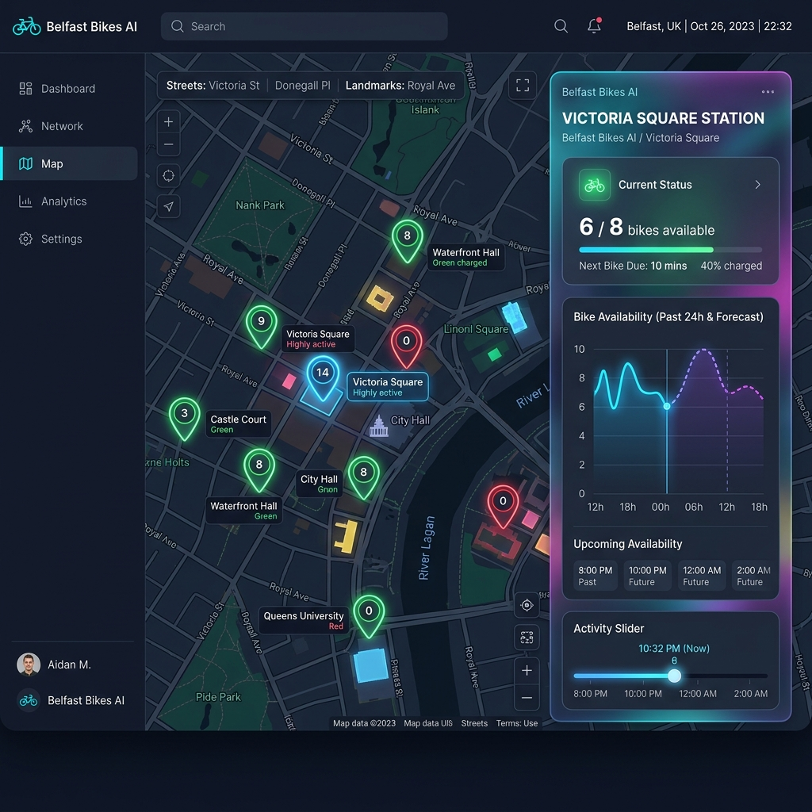

# 🚲 Belfast Bikes Predictor & Live Tracker



[](https://www.python.org/)
[](https://fastapi.tiangolo.com/)
[](https://scikit-learn.org/)
[](https://leafletjs.com/)
[](https://www.chartjs.org/)

An intelligent web application that tracks Belfast's shared bike network (operated by Beryl) in real-time, visualizes availability trends, and predicts future availability using a **Random Forest Regressor** machine learning model. Built with a premium, responsive **glassmorphism dark UI**.

---

## 🏗️ Architecture & Data Flow

This application is split into a **FastAPI backend** (which feeds the ML model and retrieves GBFS real-time data) and a **Vanilla JavaScript frontend** featuring interactive maps and charts.

```mermaid
graph TD
    subgraph Beryl GBFS Feed (Live API)
        B1[station_information.json] -->|Station Meta & Capacities| BE[FastAPI Backend]
        B2[station_status.json] -->|Real-time Bike & Dock Counts| BE
    end

    subgraph Backend Services
        BE -->|Fallback Data| FBL[Local JSON Backup]
        BE -->|Training Engine| ME[Model Trainer]
        ME -->|Historical Heuristic Patterns| TS[Synthetic Generator]
        TS -->|Random Forest Regressor| RF[Scikit-learn Model]
        BE -->|Hourly Forecast API| RF
    end

    subgraph Web App Frontend
        FE[Leaflet Map Dashboard] -->|AJAX Fetch /stations| BE
        FE -->|AJAX Fetch /history| BE
        FE -->|Draw Live Markers| MAP[Interactive Leaflet Map]
        FE -->|Draw Trends & Forecasts| CJS[Chart.js Line Chart]
        FE -->|Interactive Time Slider| SLD[Forecast Simulator]
    end
```

---

## ✨ Features

*   **🗺️ Interactive Live Map**: View all 60+ active Belfast Bike stations rendered on a custom CartoDB dark-mode map using Leaflet.js.
*   **🟢 Color-Coded Markers**: Stations are dynamically color-coded based on live bike availability:
    *   **High (Green)**: 6+ bikes available.
    *   **Medium (Sky Blue)**: 3-5 bikes available.
    *   **Critical (Pulsing Red)**: 0-2 bikes remaining (notifying commuters of low stock).
*   **📊 Double-Line Trend Chart**: Select any station to view a beautiful Chart.js visualization combining **actual past 24-hour availability** and **future 12-hour predictions**.
*   **🎛️ Forecast Simulation Slider**: Scrub through a slider (from +1h to +12h) to get a granular prediction of bike counts for any future hour.
*   **🔋 Offline Resiliency**: The backend dynamically queries Beryl's live GBFS feeds but seamlessly falls back to local data and predictions if the external API is offline.
*   **📱 Glassmorphism Dark UI**: A gorgeous responsive layout utilizing CSS backdrop filters, modern gradients, and smooth slide-in animations.

---

## 🧠 Machine Learning Details

The predictive model uses a **Random Forest Regressor** from `scikit-learn` to forecast bike availability.

### 1. Training Strategy
Because historical APIs for Belfast Bikes do not provide raw timeseries datasets, the backend implements a **high-fidelity synthetic data generator** to simulate 30 days of hourly availability for each station:
*   **Commuter Stations**: Features drop in availability during morning (7-9 AM) and evening (4-6 PM) peak hours.
*   **University Areas**: Features lower availability during active study hours (9 AM - 5 PM) and high availability on weekends.
*   **Recreation Spots**: Peak usage simulated on weekend afternoons and summer evenings.
*   **Day/Night Cycles**: Availability stays relatively static overnight.

### 2. Feature Engineering
The model is trained on:
*   `station_id`: Unique identifier for each bike bay.
*   `hour`: Hour of the day (0-23).
*   `day_of_week`: Day of the week (0=Monday, 6=Sunday).
*   `temperature`: Temperature in Celsius.
*   `is_raining`: Flag for rain (0 or 1).

On server startup, the backend automatically trains/fits the model. Requests for future predictions feed the target hour, weekday, temperature, and rain status into the random forest regressor to output the predicted number of bikes.

---

## 🚀 Setup & Installation

### Backend Setup (FastAPI)

1.  **Navigate to backend directory**:
    ```bash
    cd backend
    ```

2.  **Create and activate a virtual environment**:
    ```bash
    python3 -m venv venv
    source venv/bin/activate
    ```

3.  **Install dependencies**:
    ```bash
    pip install -r requirements.txt
    ```

4.  **Run the development server**:
    ```bash
    uvicorn main:app --reload --port 8000
    ```
    The API will start running at `http://127.0.0.1:8000`.

### Frontend Setup

1.  **Serve or open the frontend**:
    Simply open the `frontend/index.html` file directly in any modern browser, or serve it using a lightweight local server (e.g. `npx serve frontend` or VS Code Live Server).

---

## 🔌 API Endpoints

The FastAPI server exposes the following clean endpoints:

*   **`GET /stations`**: Fetches list of all stations merged with real-time Beryl GBFS counts.
*   **`GET /predict`**: Takes `station_id`, `hour`, `day_of_week`, `temperature`, and `is_raining` to return the Random Forest prediction.
*   **`GET /stations/{station_id}/history`**: Returns the combined past 24 hours of availability and the next 12 hours of predictions for Chart.js visualization.
